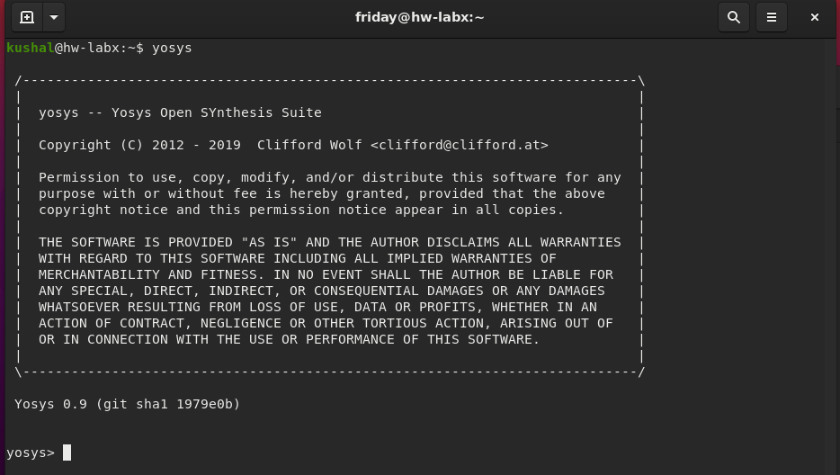
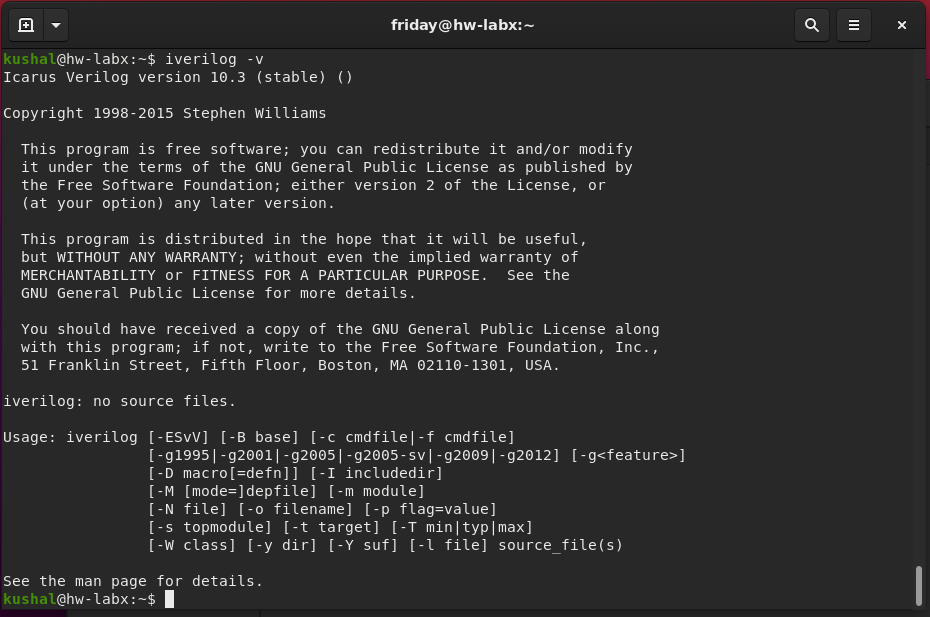
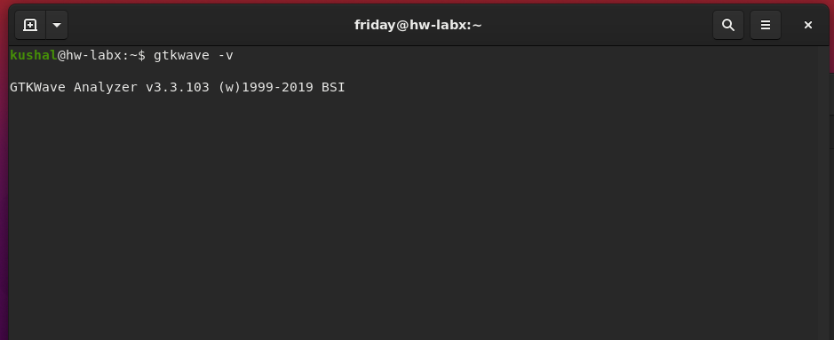
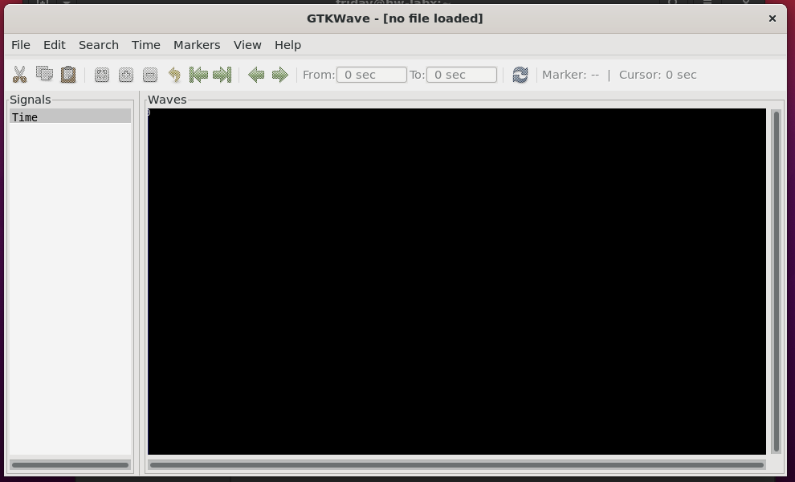
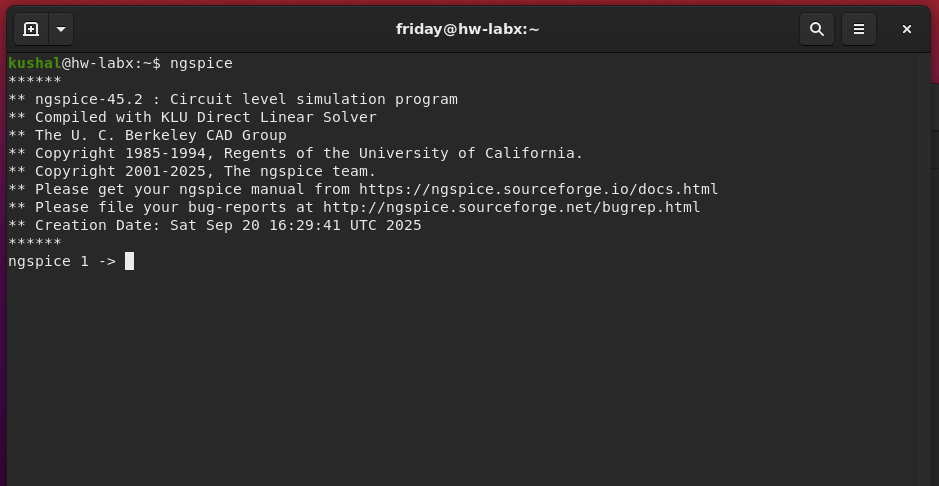

# EDA & VLSI Toolchain Installation Guide

This guide provides the complete installation instructions for a suite of essential open-source Electronic Design Automation (EDA) tools. For each tool, the required commands are listed, followed by a sample snapshot to verify a successful installation.

## Table of Contents
* [Yosys](#-yosys)
* [Icarus Verilog (iverilog)](#-icarus-verilog-iverilog)
* [GTKWave](#-gtkwave)
* [ngspice](#-ngspice)
* [Magic](#-magic)
* [OpenLane](#-openlane)

---

## 🔬 Yosys
**Yosys** is a framework for Verilog RTL synthesis. It is used to convert Verilog designs into a gate-level netlist.

### Installation Commands
```bash
# Update package lists and clone the repository
sudo apt-get update
git clone [https://github.com/YosysHQ/yosys.git](https://github.com/YosysHQ/yosys.git)
cd yosys

# Install all required dependencies
sudo apt-get install -y build-essential clang bison flex \
 libreadline-dev gawk tcl-dev libffi-dev git \
 graphviz xdot pkg-config python3 libboost-system-dev \
 libboost-python-dev libboost-filesystem-dev zlib1g-dev make

# Configure, compile, and install
make config-gcc
make
sudo make install

```



## 🐉 Icarus Verilog (iverilog)
```bash
sudo apt-get update
sudo apt-get install -y iverilog

```


## 🌊 GTKWave

```bash
sudo apt-get update
sudo apt-get install -y gtkwave
```





## ⚡ ngspice

```bash
# Unpack the downloaded tarball (assuming ngspice-37)
tar -zxvf ngspice-37.tar.gz
cd ngspice-37

# Create a separate build directory
mkdir release
cd release

# Configure the build, then compile and install
../configure --with-x --with-readline=yes --disable-debug
make
sudo make install

```



