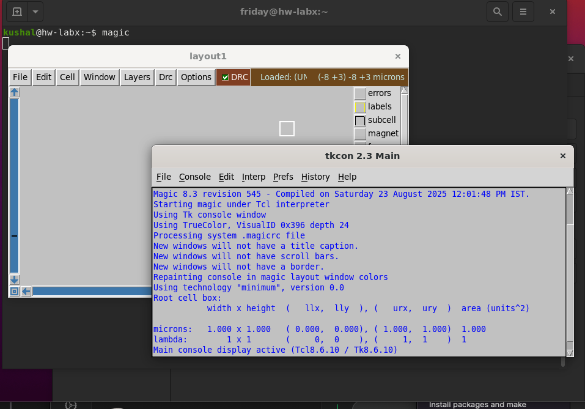
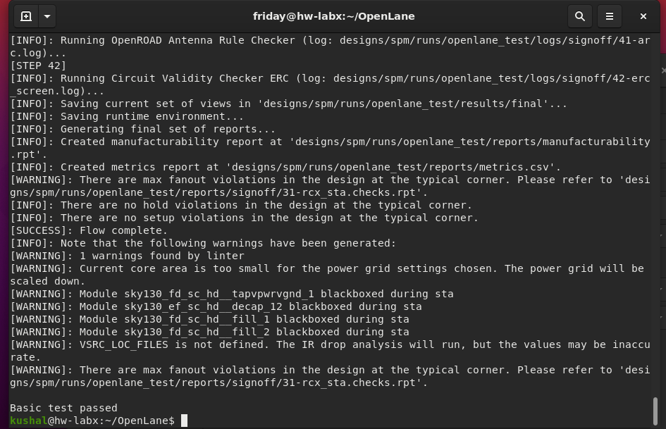

# EDA & VLSI Toolchain Installation Guide

This guide provides the complete installation instructions for a suite of essential open-source Electronic Design Automation (EDA) tools. For each tool, the required commands are listed, followed by a sample snapshot to verify a successful installation.

## Table of Contents
* [Yosys](#-yosys)
* [Icarus Verilog (iverilog)](#-icarus-verilog-iverilog)
* [GTKWave](#-gtkwave)
* [ngspice](#-ngspice)
* [Magic](#-magic)
* [OpenLane](#-openlane)

---

## 🔬 Yosys
**Yosys** is a framework for Verilog RTL synthesis. It is used to convert Verilog designs into a gate-level netlist.

### Installation Commands
```bash
# Update package lists and clone the repository
sudo apt-get update
git clone [https://github.com/YosysHQ/yosys.git](https://github.com/YosysHQ/yosys.git)
cd yosys

# Install all required dependencies
sudo apt-get install -y build-essential clang bison flex \
 libreadline-dev gawk tcl-dev libffi-dev git \
 graphviz xdot pkg-config python3 libboost-system-dev \
 libboost-python-dev libboost-filesystem-dev zlib1g-dev make

# Configure, compile, and install
make config-gcc
make
sudo make install

```


## 🐉 Icarus Verilog (iverilog)
```bash
sudo apt-get update
sudo apt-get install -y iverilog

```


## 🌊 GTKWave

```bash
sudo apt-get update
sudo apt-get install -y gtkwave
```


## ⚡ ngspice

```bash
# Unpack the downloaded tarball (assuming ngspice-37)
tar -zxvf ngspice-37.tar.gz
cd ngspice-37

# Create a separate build directory
mkdir release
cd release

# Configure the build, then compile and install
../configure --with-x --with-readline=yes --disable-debug
make
sudo make install

```


## 🧙 Magic

```bash
# Install all required dependencies in one go
sudo apt-get update
sudo apt-get install -y m4 tcsh csh libx11-dev tcl-dev tk-dev \
 libcairo2-dev mesa-common-dev libglu1-mesa-dev libncurses-dev

# Clone the repository
git clone [https://github.com/RTimothyEdwards/magic](https://github.com/RTimothyEdwards/magic)
cd magic

# Configure, compile, and install
./configure
make
sudo make install

```


## 🚗 OpenLane

```bash
# 1. Install Dependencies
sudo apt-get update && sudo apt-get upgrade -y
sudo apt-get install -y build-essential python3 python3-venv python3-pip make git

# 2. Install Docker Engine
sudo apt-get install -y apt-transport-https ca-certificates curl software-properties-common
curl -fsSL [https://download.docker.com/linux/ubuntu/gpg](https://download.docker.com/linux/ubuntu/gpg) | sudo gpg --dearmor -o /usr/share/keyrings/docker-archive-keyring.gpg
echo "deb [arch=amd64 signed-by=/usr/share/keyrings/docker-archive-keyring.gpg] [https://download.docker.com/linux/ubuntu](https://download.docker.com/linux/ubuntu) $(lsb_release -cs) stable" | sudo tee /etc/apt/sources.list.d/docker.list > /dev/null
sudo apt-get update
sudo apt-get install -y docker-ce docker-ce-cli containerd.io

# 3. Manage Docker as a non-root user
sudo groupadd docker
sudo usermod -aG docker $USER
echo "Please reboot your system now to apply Docker group changes."
sudo reboot
# After reboot, verify docker with 'docker run hello-world'

# 4. Install OpenLane and PDKs
cd $HOME
git clone [https://github.com/The-OpenROAD-Project/OpenLane](https://github.com/The-OpenROAD-Project/OpenLane)
cd OpenLane
make
```

